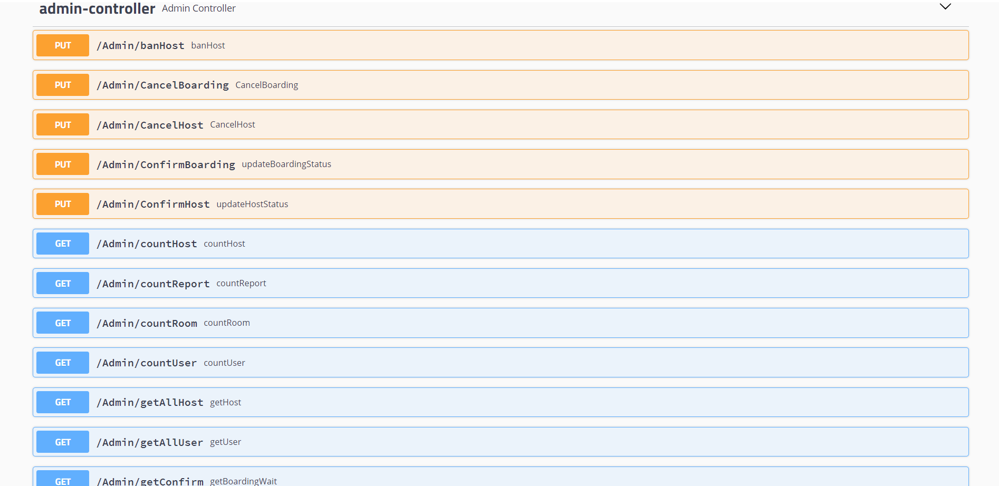
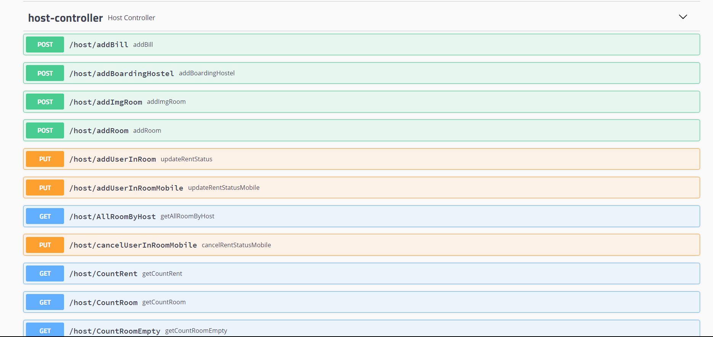
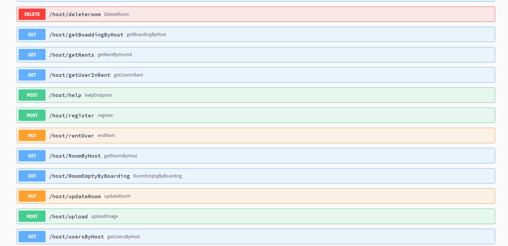
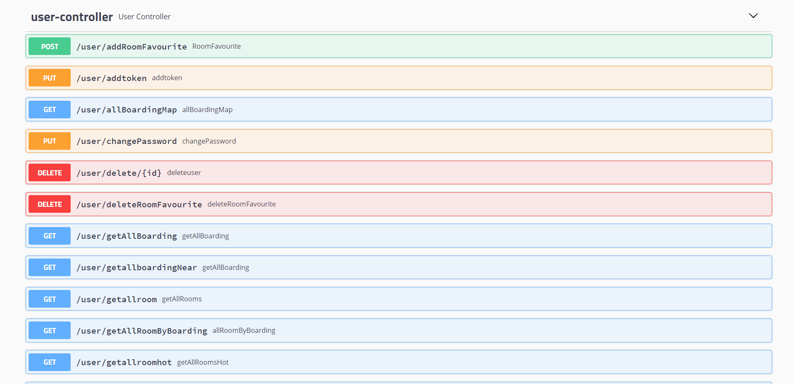
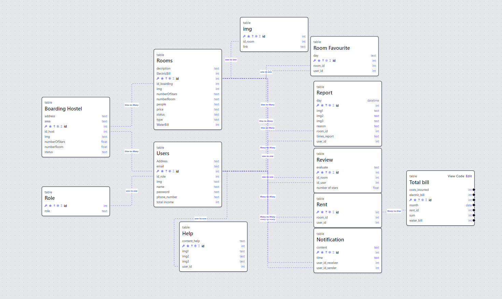

<h1>Welcome Source Code Booking Java SpringBoot</h1>
- Write API with java spring boot and Database SQL server,cloudinary,account verification phone sms firebase!  
- Link Font-end Next Js
<a>https://github.com/kun510/NextJs_BookingRoom</a>   
- Link Application Android Studio
<a>https://github.com/kun510/AppBooking</a>  

- Introducing the Booking Hostel API!

# Functions Api Web

- Java Spring Boot

  

- Role Admin

  
  

- Role Host

  
  

- Role User

  
  

- Cloudinary

  

- FireBase account verification phone sms

  

- Database

  

# Thank Youu so muchhh !!!
